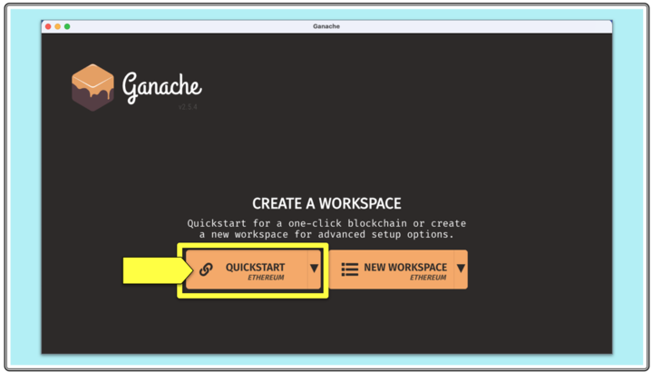
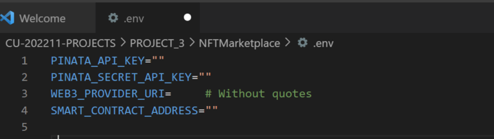
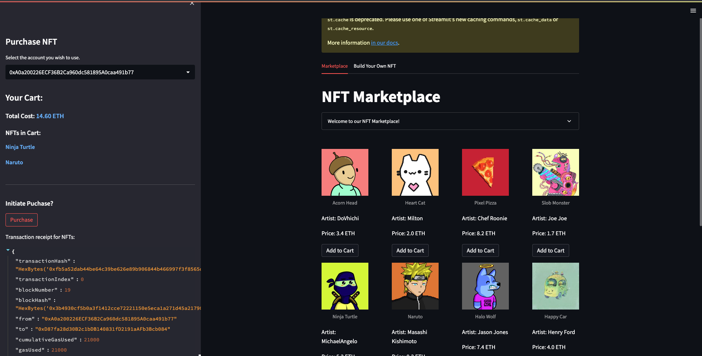
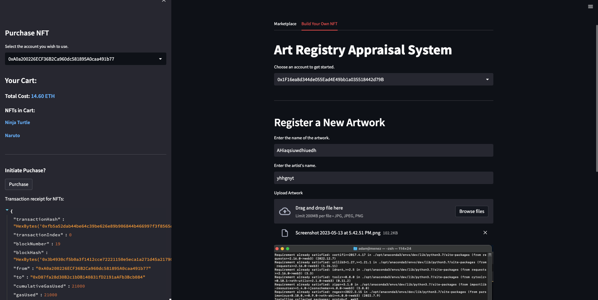

# NFTMarketplace
Project 3 for the Columbia Fintech Boot Camp

The team created an NFT Marketplace which allows the user to purchase NFTs, as well as list their own NFT on the blockchain. Purchases and sales are made with Etherium using Ganash. This is a proof of concept, meaning it does not actually implement any C2C functionality. The application used a neural network to calculate the value of the image the user uploads. The price is somewhat arbetraty, because not actual currency is being used, but the neural network is trained to provide a higher value to images that contain dogs in them.

## Table of Contents
    1. Technologies
    2. Installation guide
    3. Usage
    4. Contributors
    5. License

## Technologies
`python 3.9`

`Visual Studio Code`

*Libraries*
`pandas` library provides easy to use data structure and data analysis tools for handling and manipulating tabular & time series data.

`numpy` is a popular open-source Python library that provides support for large, multi-dimensional arrays and matrices, along with a wide range of mathematical functions to operate on them.

`streamlit` is an open-source Python library that allows users to create interactive web applications for data science and machine learning projects.

`python-dotenv` allows developers to load environment variables from a .env file into their Python applications.

`dotenv` a popular third-party Python library that allows you to load environment variables from a .env file into your Python project.

`requests` is a popular third-party Python library that makes it easy to send HTTP/1.1 requests using Python

`web3` web3.py is a Python library for interacting with Ethereum. It’s commonly found in decentralized apps (dapps) to help with sending transactions, interacting with smart contracts, reading block data, and a variety of other use cases.

`PIL` Python Imaging Library is a free and open-source additional library for the Python programming language that adds support for opening, manipulating, and saving many different image file formats

`Tensorflow` TensorFlow is a free and open-source software library for machine learning and artificial intelligence. It can be used across a range of tasks but has a particular focus on training and inference of deep neural networks

## Installation Guide

`Ganache`: The group used Ganache to obtain test accounts and run blockchain transactions. In order to install Ganache, download instructions in https://trufflesuite.com/ganache/ need to be followed. Once installed "Quickstart Ethereum" Workspace may be used to connect to the solidity contract.



`Pinata`: The application uses Pinata to upload new art images. For operating the app, Pinata API and Secret Key need to be obtained from https://www.pinata.cloud/ and then added to .env

Below is an example of what your `.env` file should look like. Make sure to fill in each variable with its corresponding value:



- Upload contract in  *.sol to remix - compile with 0.5.17
- Quick start Ethereum workspace in Ganache
- Deploy the contract with Dev-Ganache
- Obtain the deployed contract address  and save it in .env (as SMART_CONTRACT_ADDRESS)
- .env should also contain -  WEB3_PROVIDER_URI (from Ganache, i think the standard value for temp workspace is HTTP://127.0.0.1:7545), PINATA_API_KEY & PINATA_SECRET_API_KEY

```python
pip install streamlit
pip install PIL
pip install tensorflow
pip install keras
pip install numpy
pip install web3
```

- streamlit run app.py

## Usage

The front end of the application was developed using the `Streamlit` library. The backend operates using Ganash and Pinata to perform transactions and uploading of images, respectively. Tensorflow is used to develop a neural network that analyzes the image uploaded by the user and estimates its value based on our specific criteria.





## Limitations
Due to time and processing power limitations, the neural network is certainly not perfect. With more of these resources, the network would be trained on a far larger set of images

Additionally, as mentioned before, the project does not have any functionality for multiple users. This is by design as the project is a proof of concept, but certainly a limitation at this time.


## Next Steps
Future application updates would include
- C2C functionality
- Realistic pricing estimations based on real time listings
- Connection with real ETH wallets
- Improved neural network

# Project Presentation

https://docs.google.com/presentation/d/1kOokQ5wRKEBlIOMaqFgB842Jf6KniIOsa_nrDA0u_a4/edit?usp=sharing

---

## Contributors

Adam Jimenez
Vincent Sgarzi
Baha Amour
Kunal Srinivasan

---

## License

Columbia University, Fintech Bootcamp 2023
